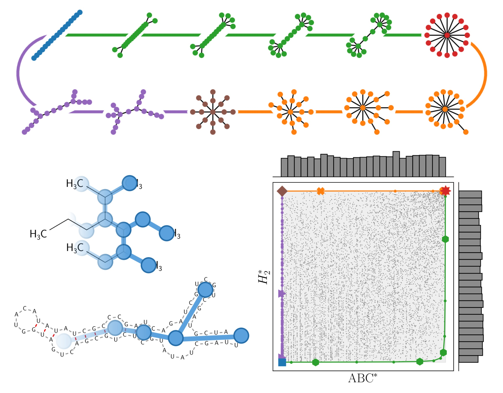

# Topological indices

This repository contains code related to the article [Vaupotič, D., Morand, J., Tubiana, L., Božič, A. _Normalized topological indices discriminate between architectures of branched macromolecules_. 2025](https://arxiv.org/abs/2409.16007).



# Installation and configuration

```sh
python -m venv .venv --prompt topological-indices

# On Linux/macOS:
source .venv/bin/activate
# On Windows:
.venv\Scripts\activate

pip install -e src
pip install -r requirements.txt
```

## Additional libraries

For generating RNA structures, [ViennaRNA](https://www.tbi.univie.ac.at/RNA/) should be installed. After that, set `viennarna_path` in `config.toml` to the directory containing ViennaRNA executables.

If generation of $n$-cyclic graphs is needed, [nauty](https://pallini.di.uniroma1.it/) should be installed. After that, set `nauty_path` in `config.toml` to the directory containing nauty executables.

Topological information content $I$ is calculated with `pynauty` wrapper for nauty, which is available only on Linux.

# Usage

See [`topological_indices.ipynb`](topological_indices.ipynb).

## Citation

If you use this code in your work, please cite our article:

> Vaupotič, D., Morand, J., Tubiana, L., Božič, A. _Normalized topological indices discriminate between architectures of branched macromolecules_. 2025. [arXiv:2409.16007](https://arxiv.org/abs/2409.16007)
